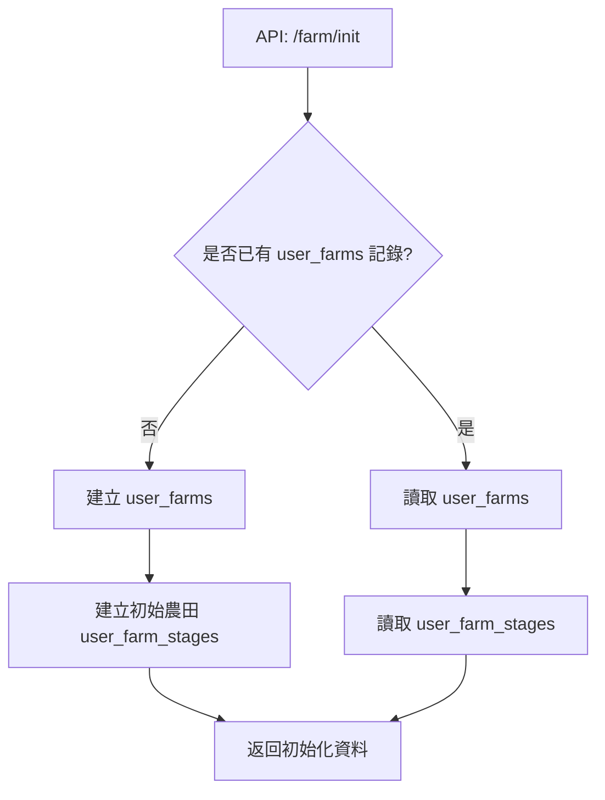

```mermaid
flowchart TD
    A[API: /farm/init] --> B{是否已有 user_farms 記錄?}
    B -- 否 --> C[建立 user_farms]
    C --> D[建立初始農田 user_farm_stages]
    D --> E[返回初始化資料]

    B -- 是 --> F[讀取 user_farms]
    F --> G[讀取 user_farm_stages]
    G --> E
```
